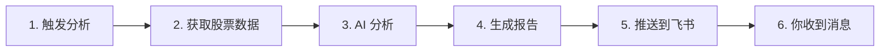

# 📋 飞书推送配置完成总结

## ✅ 已完成的工作

### 1. 配置验证
- ✅ 飞书 Webhook URL: 已配置
- ✅ 签名验证: 已启用
- ✅ 测试推送: **2条消息发送成功**

### 2. 创建的工具脚本
- ✅ `test_feishu_simple.py` - 简单测试脚本
- ✅ `send_sample_analysis.py` - 发送样例分析报告
- ✅ `start.sh` - 交互式启动菜单（推荐使用）

### 3. 文档
- ✅ `飞书推送使用指南.md` - 详细使用说明
- ✅ `快速开始.md` - 快速上手指南

---

## 🎯 Webhook 触发机制详解

### ❓ 你的问题：webhook 是怎么触发的？

### ✅ 答案：三种方式任选

| 方式 | 触发时机 | 推送时机 | 适用场景 |
|-----|---------|---------|---------|
| **手动触发** | 你运行 `python3 main.py` | 分析完成后立即推送 | 测试、按需分析 |
| **本地定时** | 每天 18:00 自动执行 | 分析完成后自动推送 | 本地Mac常开机 |
| **GitHub Actions** | 云端每天 18:00 自动执行 | 分析完成后自动推送 | **推荐**,零成本,无需本地运行 |

---

## 🚀 立即开始使用

### 方式1: 使用快速启动脚本（最简单）

```bash
cd /Users/huixia.huang/daily_stock_analysis
./start.sh
```

然后选择你需要的功能:
- `1` - 完整分析并推送到飞书
- `4` - 测试飞书推送
- `10` - 查看配置信息

### 方式2: 直接运行命令

```bash
# 完整分析（推荐先用这个测试）
python3 main.py

# 仅测试推送
python3 test_feishu_simple.py

# 查看帮助
python3 main.py --help
```

---

## 📱 推送流程说明



### 详细说明

1. **触发分析**
   - 手动: 运行 `python3 main.py`
   - 自动: 定时任务到点自动执行
   - 云端: GitHub Actions 每天 18:00

2. **获取数据**
   - 从 AkShare/eFiance 等数据源获取行情
   - 可选: 搜索最新新闻（需配置搜索 API）

3. **AI 分析**
   - 使用 DeepSeek 模型进行智能分析
   - 生成买卖建议、风险提示、操作清单

4. **生成报告**
   - Markdown 格式
   - 包含决策仪表盘、详细分析、市场复盘

5. **推送到飞书**
   - 调用飞书 Webhook API
   - 使用交互式卡片格式（支持 Markdown）
   - 自动分批处理超长消息

6. **接收消息**
   - 你在飞书群收到推送
   - 可以查看完整的分析报告

---

## ⏰ 定时任务配置

### 当前状态
- ⚠️ **本地定时任务**: 未启用 (`SCHEDULE_ENABLED=false`)
- 📅 **配置时间**: 18:00
- ✅ **大盘复盘**: 已启用

### 启用本地定时任务

**方法1: 修改 .env 文件**
```bash
# 编辑配置
vim .env

# 修改这一行
SCHEDULE_ENABLED=true
```

**方法2: 使用快速脚本**
```bash
./start.sh
# 选择 7) 启动定时任务
```

**后台运行（推荐）**
```bash
nohup python3 main.py --schedule > schedule.log 2>&1 &

# 查看日志
tail -f schedule.log

# 停止服务
ps aux | grep "python3 main.py --schedule"
kill <进程ID>
```

---

## 🌐 GitHub Actions 配置（推荐）

### 为什么推荐?

1. ✅ **零成本**: GitHub 免费提供
2. ✅ **零维护**: 无需本地运行
3. ✅ **高可靠**: 云端自动执行
4. ✅ **易管理**: 网页界面随时查看

### 快速配置步骤

1. **Fork 本仓库**
   ```
   https://github.com/ZhuLinsen/daily_stock_analysis
   ```

2. **配置 Secrets**
   ```
   Settings → Secrets and variables → Actions
   ```

   从你的 `.env` 复制这些值:
   - `OPENAI_API_KEY`
   - `OPENAI_BASE_URL`  
   - `OPENAI_MODEL`
   - `FEISHU_WEBHOOK_URL`
   - `FEISHU_WEBHOOK_SECRET`
   - `STOCK_LIST`

3. **启用 Actions**
   ```
   Actions → Enable workflows
   ```

4. **完成!**
   - 自动执行: 每周一到五 18:00
   - 手动执行: Actions 页面点击 "Run workflow"

### 执行时间说明

当前配置: **每周一到五 18:00**（北京时间）

修改执行时间:
```yaml
# .github/workflows/daily_analysis.yml
schedule:
  - cron: '0 10 * * 1-5'  # UTC 10:00 = 北京时间 18:00
```

常用时间对照:
| 北京时间 | Cron 表达式 |
|---------|------------|
| 09:30 | `'30 1 * * 1-5'` |
| 15:00 | `'0 7 * * 1-5'` |
| 18:00 | `'0 10 * * 1-5'` |
| 21:00 | `'0 13 * * 1-5'` |

---

## 📊 推送效果预览

### 你已经收到的测试消息

1. ✅ **简单测试消息** - 验证配置正确
2. ✅ **股票分析样例** - 展示完整报告格式

### 真实分析报告包含

```
🎯 决策仪表盘
├─ 分析摘要（买入/观望/卖出统计）
├─ 每只股票详细分析
│  ├─ 📰 重要信息速览
│  ├─ 💭 舆情情绪
│  ├─ 🚨 风险警报
│  ├─ ✨利好催化
│  └─ 🎯 操作建议（买入价/止损价/目标价）
└─ 📊 大盘复盘
   ├─ 主要指数表现
   ├─ 市场概况
   └─ 板块分析
```

---

## 🛠️ 常用命令速查表

### 基础命令
```bash
# 完整分析
python3 main.py

# 仅股票分析
python3 main.py --no-market-review

# 仅大盘复盘
python3 main.py --market-review

# 指定股票
python3 main.py --stocks 159636,159740
```

### 测试命令
```bash
# 测试飞书推送
python3 test_feishu_simple.py

# 发送样例报告
python3 send_sample_analysis.py

# 数据获取测试（不分析）
python3 main.py --dry-run
```

### 定时任务
```bash
# 前台运行
python3 main.py --schedule

# 后台运行
nohup python3 main.py --schedule > schedule.log 2>&1 &

# 查看日志
tail -f schedule.log
```

### 快捷脚本
```bash
# 交互式菜单
./start.sh
```

---

## 📝 配置文件说明

### .env 关键配置

```bash
# ============ 定时任务 ============
SCHEDULE_ENABLED=false          # 是否启用本地定时
SCHEDULE_TIME=18:00            # 执行时间
MARKET_REVIEW_ENABLED=true     # 大盘复盘

# ============ 飞书配置 ============
FEISHU_WEBHOOK_URL=https://...  # Webhook地址
FEISHU_WEBHOOK_SECRET=xxx       # 签名密钥

# ============ 报告设置 ============
REPORT_TYPE=full               # simple/full
SINGLE_STOCK_NOTIFY=false      # 单股推送模式
ANALYSIS_DELAY=10              # 分析间隔（秒）

# ============ 股票列表 ============
STOCK_LIST=159636,159740,159928,588920,516270,159525,512980
```

---

## ❓ 常见问题

### Q1: 我现在运行会立即推送吗?
**A**: 是的! 运行 `python3 main.py` 后,分析完成就会立即推送到飞书。

### Q2: 如何实现每天自动推送?
**A**: 三种方式:
- **最推荐**: 配置 GitHub Actions (云端,零成本)
- **本地**: 修改 `.env` 启用定时任务
- **手动**: 每天手动运行一次

### Q3: 定时任务现在是启用的吗?
**A**: 不是。当前 `SCHEDULE_ENABLED=false`。需要手动启用。

### Q4: GitHub Actions 什么时候执行?
**A**: 
- 自动: 每周一到五 18:00 (北京时间)
- 手动: Actions 页面随时触发

### Q5: 推送失败了怎么办?
**A**: 
1. 检查 Webhook URL
2. 查看日志: `tail -f logs/stock_analysis_*.log`
3. 运行测试: `python3 test_feishu_simple.py`

---

## 🎯 推荐使用方案

### 新手推荐
1. ✅ 先运行 `python3 main.py` 测试一次
2. ✅ 确认飞书收到消息
3. ✅ 配置 GitHub Actions 实现自动化

### 日常使用
- **GitHub Actions**: 工作日自动推送
- **手动触发**: 周末或临时需要时运行

### 高级用户
- 本地定时 + GitHub Actions 双保险
- 配合 WebUI 进行可视化管理
- Docker 部署,集成到服务器

---

## 📚 相关文档

- [飞书推送使用指南.md](./飞书推送使用指南.md) - **详细使用说明**
- [快速开始.md](./快速开始.md) - 快速上手
- [README.md](./README.md) - 项目介绍
- [docs/full-guide.md](./docs/full-guide.md) - 完整配置指南
- [docs/FAQ.md](./docs/FAQ.md) - 常见问题

---

## ✅ 总结

### 你的当前状态
- ✅ 飞书机器人配置完成
- ✅ 测试推送成功（已收到2条消息）
- ✅ AI 模型配置完成（DeepSeek）
- ✅ 股票列表已配置（7只ETF）
- ⏳ 定时任务待启用（可选）

### 下一步建议

**立即可用**:
```bash
python3 main.py
```
运行后等待几分钟,飞书会收到完整的股票分析报告。

**实现自动化**:
1. Fork 本仓库到 GitHub
2. 配置 Secrets
3. 启用 Actions
4. 每天 18:00 自动收到分析报告

---

**现在就开始吧!** 🚀

```bash
cd /Users/huixia.huang/daily_stock_analysis
./start.sh
```

祝投资顺利! 📈💰
